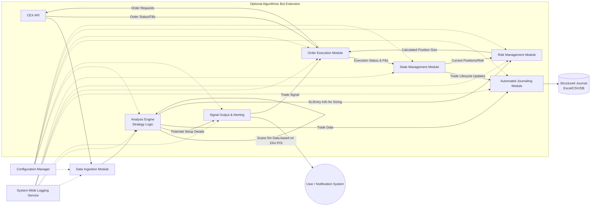

# Implementation Plan: Crypto Futures Trading Scanner & Bot

**Strategy Focus:** 5m/15m BOS/FVG/Fib Confluence - $1 Fixed Risk
**Last Updated:** May 7, 2025

## 1. Project Overview & Goals

This document outlines the technical and architectural plan for developing a Python-based system to support the "5m/15m BOS/FVG/Fib Confluence - $1 Fixed Risk" trading strategy.

* **Primary Goal (Scanner):** Develop a Python application that connects to a Centralized Exchange (CEX) API to scan the top N cryptocurrencies by volume. The scanner will identify potential trading setups based on the predefined strategy rules, focusing on 15-minute contextual analysis and 5-minute entry signals.
* **Secondary Goal (Automated Journaling):** Automatically log identified setups, trade parameters, and (if bot is developed) trade outcomes to a structured format (e.g., CSV/Excel/Database).
* **Tertiary Goal (Algorithmic Bot - Future Extension):** Extend the scanner into a fully algorithmic trading bot capable of executing trades (entry, stop-loss, take-profit) based on the scanner's signals and managing them according to the strategy's risk parameters ($1 fixed risk per trade).
* **Quaternary Goal (AI Implementation - Future Research):** Explore the potential of integrating AI/ML models to refine subjective aspects of the strategy, such as optimizing SL/TP placement, dynamic confidence scoring, or market regime identification.

## 2. System Architecture (High-Level)

The system will be modular, allowing for phased development, easier maintenance, and independent testing of components.

### Key Components:
* **Data Ingestion Module:** Handles all communication with the CEX API for market data (OHLCV, order book depth if needed, contract specifications) and account data (for bot).
* **Analysis Engine:** Contains the core logic implementing the trading strategy (BOS, FVG, Fibonacci, confluence checks on 15m and 5m).
* **Risk Management Module:** Crucially calculates position size based on the $1 fixed dollar risk and stop-loss distance. Monitors overall risk exposure if multiple trades are active (for bot).
* **Signal Output & Alerting:** For the scanner, this module will present identified setups to the user (e.g., console, file, Telegram/Discord bot, email).
* **Automated Journaling Module:** Logs all relevant details of identified setups and executed trades.
* **Order Execution Module (Bot Only):** Places, monitors, and manages orders (entry, SL, TP) via the CEX API.
* **State Management Module (Bot Only):** Tracks active trades, open orders, current P&L, and overall portfolio status for the bot.
* **Configuration Manager:** Loads and provides access to all settings (API keys, strategy parameters, coin lists, risk limits).
* **System-Wide Logging Service:** Provides robust logging for diagnostics, errors, and operational tracking.

## 3. Technical Stack

**Programming Language:** Python 3.9+

**Core Libraries:**
* **CEX API Interaction:** ccxt (highly recommended for its support for numerous exchanges and unified API).
* **Data Handling & Analysis:** pandas (for OHLCV data manipulation, time series analysis), numpy (for numerical operations).
* **Technical Indicators:**
  * TA-Lib (if needed for standard indicators, though BOS, FVG, Fib might be custom).
  * Custom functions using pandas/numpy for BOS detection, FVG identification, and Fibonacci calculations.
* **Scheduling (for periodic scans):** APScheduler (more robust for complex scheduling) or schedule (simpler).
* **Asynchronous Operations (highly recommended for concurrent API calls & responsiveness):** asyncio (Python's built-in library), aiohttp (for asynchronous HTTP requests if not fully covered by ccxt's async capabilities).
* **Data Output (Journal):** openpyxl or XlsxWriter (for .xlsx), csv (Python's built-in module).
* **Database (Optional, for more robust journaling & state management):** sqlite3 (Python's built-in), SQLAlchemy (ORM for flexibility with databases like PostgreSQL, MySQL).
* **Configuration Management:** python-dotenv (for loading API keys from .env files), configparser (for .ini files), or YAML (PyYAML).
* **Logging:** logging (Python's built-in module), potentially with extensions like loguru for ease of use.
* **Notifications (Optional):** Libraries for Telegram bots (python-telegram-bot), Discord bots (discord.py), or email (smtplib).

## 4. Detailed Component Breakdown & Implementation Steps

### 4.1. Data Ingestion Module

**Functionality:**
* Securely load and manage API keys (read-only for scanner, trade permissions for bot).
* Fetch historical and real-time OHLCV data for multiple symbols on 15m and 5m timeframes.
* Fetch necessary contract specifications: tick size, contract value/multiplier, minimum/maximum order size, leverage tiers.
* Implement robust rate limit handling (e.g., exponential backoff, tracking API call weights).
* Comprehensive error handling for API request failures, timeouts, and unexpected responses from the CEX.
* Data validation and cleaning (checking for missing bars, outlier prices, etc.).

**Implementation Notes:**
* Design functions to fetch data asynchronously if scanning many coins.
* Cache contract specifications if they don't change often to reduce API calls.
* Normalize data format if data from different exchanges might be used in the future.

### 4.2. Analysis Engine (Strategy Logic Implementation)

**Functionality:**
* **Swing High/Low Detection:** Implement a parameterized function (e.g., detect_swing_points(dataframe, lookback_left, lookback_right)) for both 15m and 5m charts. Consider using ta.pivothigh/ta.pivotlow or a custom algorithm.
* **Break of Structure (BOS) Detection:** Function to identify when price closes decisively beyond a confirmed swing point, for a specified number of confirmation candles.
* **Impulse Leg Identification:** Logic to define the start and end of the impulsive move that caused the BOS. This is critical and often the most subjective part to automate (e.g., from the swing point preceding the break to the new extreme after the break).
* **Fair Value Gap (FVG) Identification:** Function to scan candles (especially within the identified impulse leg) for the 3-candle FVG pattern, returning its top and bottom levels.
* **Fibonacci Retracement Calculation:** Function to calculate 0.50, 0.618, 0.786 levels based on the identified impulse leg.
* **Point of Interest (POI) / Confluence Check:** Logic to determine if a 15m FVG aligns with key 15m Fibonacci levels and is near the retest of the broken 15m structure.
* **5m Entry Signal Logic:** Once price enters the 15m POI, this logic scans the 5m chart for entry triggers (mitigation of a 5m FVG within the POI, or a 5m Market Structure Shift/BOS in the direction of the 15m bias).

**Implementation Notes:**
* All strategy parameters (lookbacks, Fib levels to use, FVG sensitivity) should be configurable.
* Code should clearly separate 15m analysis (for POI definition) from 5m analysis (for entry triggers within the POI).
* Ensure calculations are performed on closed candle data to avoid premature signals (especially for request.security calls from higher timeframes).

### 4.3. Risk Management Module

**Functionality:**
* Position Size Calculation:
  * Inputs: Entry Price, Stop-Loss Price, Asset, Fixed Dollar Risk (e.g., $1).
  * Fetches/uses cached contract specifications (tick size, value per tick/point).
  * Calculates SL distance in price and ticks.
  * Calculates Risk_per_contract_if_SL_hit.
  * Calculates Position_Size = Fixed_Dollar_Risk / Risk_per_contract_if_SL_hit.
  * Adjusts calculated position size to meet exchange's minimum/maximum order size and step size (lot size) requirements, aiming to keep risk as close as possible to the target $1.
* (For Bot) Monitor overall portfolio exposure if multiple trades on correlated assets are considered.
* (For Bot) Check available margin before placing a trade.

**Implementation Notes:** This module is paramount for safety. Test calculations rigorously with actual contract specs from your CEX. Handle potential division by zero if SL distance is too small.

### 4.4. Signal Output & Alerting Module (Scanner)

**Functionality:**
* When the Analysis Engine identifies a valid setup matching all criteria:
  * Format a clear signal message: Coin, Direction (Long/Short), 15m POI coordinates (FVG range, relevant Fib levels), 5m Entry Trigger (e.g., "Entered 5m FVG at X price"), suggested SL (based on 5m structure).
  * Output to console.
  * Log to a dedicated signals file.
  * (Optional) Send notifications via Telegram, Discord, or email.

**Implementation Notes:** Make alert messages configurable and informative.

### 4.5. Automated Journaling Module

**Functionality:**
* For Scanner Signals: Log timestamp, pair, direction, all 15m POI details (BOS level, impulse start/end, FVG coordinates, Fib levels touched), 5m entry trigger details, and a rule-based confidence score.
* For Bot Trades: Extend logging to include entry fill price, SL order ID, TP order ID(s), exit price, P&L (gross and net of fees), fees paid, funding paid/received, duration of trade, reason for exit (SL, TP, manual).
* Confidence Score (Rule-Based Initial): Implement a heuristic (e.g., +1 for clear 15m BOS, +1 for FVG in POI, +1 for Fib confluence, +1 for retest of structure, +1 for clear 5m entry signal).

**Implementation Notes:**
* Use CSV for simplicity initially. Append new entries.
* For more robust storage and querying, use SQLite or a server-based database. Define a clear schema.

### 4.6. Order Execution Module (Bot Only - Future Extension)

**Functionality:**
* Receive trade signals (including calculated position size, entry price range, SL price, TP price(s)).
* Place entry orders (market or limit, configurable).
* Place corresponding stop-loss orders (e.g., STOP_MARKET) immediately after entry confirmation.
* Place take-profit orders (e.g., LIMIT orders). Consider OCO (One-Cancels-Other) if supported and applicable for SL/TP.
* Handle order lifecycle: submission confirmations, partial fills (potentially complex), cancellations, modifications (e.g., for trailing SL).
* Utilize Isolated Margin for each trade if supported by the CEX.
* Send correct leverage parameter if required by API for chosen margin mode.

**Implementation Notes:** This is the most critical part for financial safety. Implement extensive error handling, retry logic for temporary API issues, and fail-safes. Test exhaustively on a demo account.

### 4.7. State Management Module (Bot Only - Future Extension)

**Functionality:**
* Maintain real-time status of:
  * Current open positions (symbol, size, entry price, direction, current P&L).
  * Active SL/TP orders linked to open positions.
  * Overall account balance and available margin.
* Enforce daily loss limits (prevent new trades if daily $ loss or # of losing trades limit is hit).
* Enforce maximum concurrent open trades.

**Implementation Notes:** Can start with in-memory data structures. For persistence across bot restarts, a simple database (SQLite) or state files would be necessary.

### 4.8. Configuration Manager

**Functionality:**
* Load settings from external files (e.g., JSON, YAML, INI).
* Provide easy access to configuration values throughout the application.
* Parameters to Configure: API keys (path to secure storage, not the keys themselves), list of coins to scan/trade, strategy parameters (lookbacks, Fib levels, FVG sensitivity, R:R ratios for TP), risk parameters (daily loss limits), notification settings.

**Implementation Notes:** Use python-dotenv for API keys stored in a .env file (which is not committed to version control).

### 4.9. System-Wide Logging Service

**Functionality:** Implement comprehensive logging across all modules.
* Details: Timestamps, log levels (DEBUG, INFO, WARNING, ERROR, CRITICAL), module name, messages.
* Purpose: Essential for debugging issues, monitoring scanner/bot health, auditing decisions and actions.

**Implementation Notes:** Utilize Python's built-in logging module. Configure different handlers for console output and file output (with log rotation).

## 5. AI Implementation (Future Research Considerations)

**Potential Areas:**
* **Dynamic SL/TP Adjustment:** AI model predicts optimal SL/TP based on current volatility, market structure context, or order flow, rather than fixed rules.
* **Enhanced Setup Confidence Scoring:** A ML model trained on historical setups and their outcomes to provide a more nuanced probability of success.
* **Pattern Recognition Refinement:** Improving the algorithmic detection of "significant" BOS or "high-probability" FVGs.
* **Market Regime Filtering:** AI to classify current market conditions (trending, ranging, high/low volatility) and adapt strategy or pause trading.

**Data Requirements:** Large, high-quality, labeled historical dataset of trades (both wins and losses from the base strategy) and corresponding market data features.

**Complexity:** This is a significant R&D effort requiring expertise in machine learning, feature engineering, and model validation.

## 6. Development & Deployment Strategy

**Phased Development:**
* **Phase 1 (Core Data & Basic Logic):** Data Ingestion setup for a single coin. Implement and test core pattern detection functions (Swing Points, BOS, FVG, Fibs) on historical data.
* **Phase 2 (Scanner v1):** Integrate logic for 15m POI identification and 5m entry signals for multiple coins. Basic console/file signal output.
* **Phase 3 (Journaling & Scanner Refinement):** Implement automated journaling for signals. Rigorously test scanner output against charts (manual backtesting/forward testing). Refine parameters.
* **Phase 4 (Bot - Risk & Order Primitives - Paper Trading):** Develop Risk Management (position sizing) and basic Order Execution modules. Connect to CEX Demo Account. Focus on reliable order placement and SL execution for the $1 risk.
* **Phase 5 (Bot - Full Logic - Paper Trading):** Integrate full strategy logic into the bot for automated entry based on scanner signals. Implement State Management. Extensive paper trading.
* **Phase 6 (Bot - Limited Live Risk):** Only after consistent positive performance in paper trading for a significant period. Start with minimal actual capital exposure beyond the $1 per trade (e.g., small total account for this bot).
* **Phase 7 (AI Exploration):** Post-stabilization and validation of the core mechanical system.

**Version Control:** Use Git and a repository (e.g., GitHub, GitLab, Bitbucket) from the very beginning. Use branches for feature development.

**Testing Strategy:**
* **Unit Tests:** For individual functions (indicator calculations, position sizing logic, API interaction wrappers).
* **Integration Tests:** Test how modules interact (e.g., data flow from ingestion to analysis to signal).
* **Backtesting (Simulation):** If possible, develop a simple event-driven backtester to simulate strategy performance on historical data. Account for estimated fees and slippage. (Accurate low-timeframe futures backtesting is hard).
* **Forward Testing (Paper Trading):** Absolutely essential. Run the scanner and then the bot on a CEX demo account for an extended period to observe real-world behavior with live data feeds, latency, and API quirks.

**Deployment Environment:**
* **Scanner/Development:** Can run on a local machine.
* **Continuous Bot Operation:** A Virtual Private Server (VPS) or a cloud instance (AWS EC2, Google Cloud Compute Engine, Azure Virtual Machines) is highly recommended for stability, reliability, and low latency (choose server location geographically close to CEX servers).

**Security:**
* **API Keys:** Store extremely securely. Use environment variables, hardware security modules if possible, or encrypted configuration files. Never commit API keys to version control. Use IP whitelisting for API keys if the CEX supports it, restricting access to your server's IP.
* **Secure Coding Practices:** Be mindful of potential vulnerabilities if any part of the system is exposed (e.g., a web dashboard).
* **Dependencies:** Keep all Python libraries updated to patch security vulnerabilities.

## 7. Risk Assessment of the Project

**Technical Risks:**
* Bugs in strategy logic leading to incorrect signals or trades.
* Errors in position sizing calculation leading to incorrect risk exposure.
* CEX API downtime, changes, or rate-limiting issues disrupting operation.
* Performance bottlenecks with many coins or complex calculations.
* Failures in error handling leading to unexpected bot behavior.

**Market Risks (primarily for the Bot):**
* The trading strategy itself may not be profitable in live market conditions.
* Extreme market volatility causing excessive slippage on entries/exits, or stop-losses not being filled at the intended price (potentially exceeding $1 risk).
* Flash crashes or sudden market spikes.

**Operational Risks (for the Bot):**
* Bot crashing or becoming unresponsive without alerts.
* Internet connectivity issues for the server running the bot.
* Power outages (if self-hosted without backup).
* Failures in the journaling system leading to loss of trade records.

**Dependency Risks:**
* Reliance on third-party libraries (e.g., ccxt) being maintained and secure.
* Changes to CEX API or contract specifications requiring code updates.

## 8. Timeline & Milestones (High-Level Sketch)

This is a rough estimate and highly dependent on developer experience and dedicated time.

* **M1 (Weeks 1-4):** Project Setup, CEX API connection established, Data Ingestion for 1-2 coins (15m & 5m OHLCV), basic Swing Point and FVG detection functions developed and tested.
* **M2 (Weeks 5-8):** BOS logic, Fibonacci calculation, initial 15m POI confluence logic for Scanner. Basic signal output (console). Start journaling module.
* **M3 (Weeks 9-12):** Full Scanner logic for top N coins. Integration of 5m entry conditions. Refined alerting. Parameterization and configuration management. Manual backtesting/forward testing of scanner signals.
* **M4-M6 (If proceeding with Bot - 2-3+ months):** Development of Risk Management (Position Sizing), Order Execution, and State Management modules. Rigorous testing on CEX Demo Account.
* **M7+ (Ongoing):** Maintenance, monitoring, performance review, potential refinements, exploration of AI enhancements.